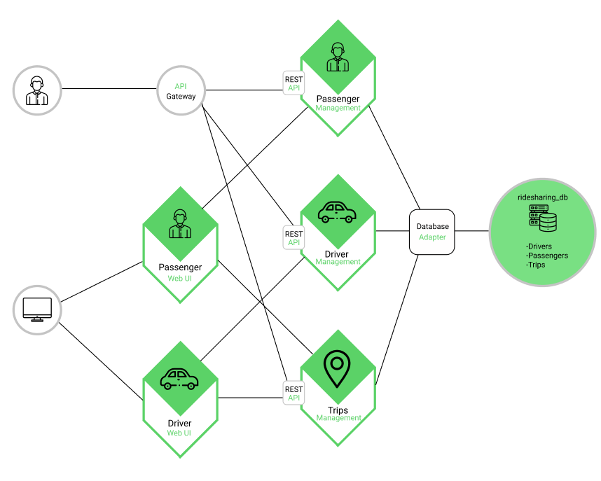

# GrabnGo 
> ETI Assignment 1

## Design consideration for Microservices

GrabnGo is created based on three different microservices: `Driver`, `Passenger`, `Trip`.
> Consideration #1: Independent microservice
They, each run independently from one and other as a microservice. Capable of CRUD, the four main functions considered necessary to implement a persistent storage application, `create`, `read`, `update`, `delete`. However, in this project, `delete` is removed due to audit purposes.
> Consideration #2: Loosely coupled microservices
In GrabnGo, the microservices are decoupled from each other, as the microservices handles easy task and logic. Hence, there is not a need for dependency of the microservices and would require the user to call from each microservices API to request/receive inputs from the respective microservice it is calling. 

## Microservice Architecture Diagram


## Instructions for setting up and running the Database, Microservices and Console

### 1. Create a new database
Connect to your MySQL Workbench, create a new query and run the following
```
CREATE database ridesharing_db;
```
> Inside the folders ETIAssignment1 Folder, you can look out for a folder call `mysql`, in it there is a myETIAssignment.sql that consists of the original mysqldump with all the required variables to run the test. 
### 2. Run the Microservices
In Visual Studio Code, ensure you have the "Terminal" tab, create 4 new Terminal in order to run the
-Microservices
-Console Application
>Do take note that these manual steps are required in order to test the microservices and console application.

>Please kindly ensure you have cd into the right folder, i.e. `cd ETIAssignment1` --> `C:..\..\ETIAssignment1` for this test
Once you are on the right path/folder, 
```
cd Passenger
```
```
cd Driver
```
```
cd Trip
```
For each respective terminal...

Then, run main.go in each of "Microservice" folder
```
go run main.go
```

### 3. Run the Console Application
>Please kindly ensure you have cd into the right folder, i.e. `cd ETIAssignment1` --> `e.g C:..\..\ETIAssignment1` for this test
Once you have on the right folder all the microservices are running, on the 4th terminal 
```
cd Console
```
Then, run main.go in the "Console" folder
```
go run main.go
```

### 4. Sample of initial start up of Microservices and Console Application
You should be able to see the following if the microservices/console are running:

Microservices
```
Driver microservice API --> Listening at port 5000
Passenger microservice API --> Listening at port 5001
Trip microservice API --> Listening at port 5002
```

Console Application
```
Welcome to GrabnGo!
[1] Login as Passenger
[2] Login as Driver
[3] Register Passenger Account
[4] Register Driver Account
[0] Quit

Enter your option:
```